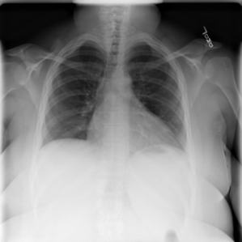
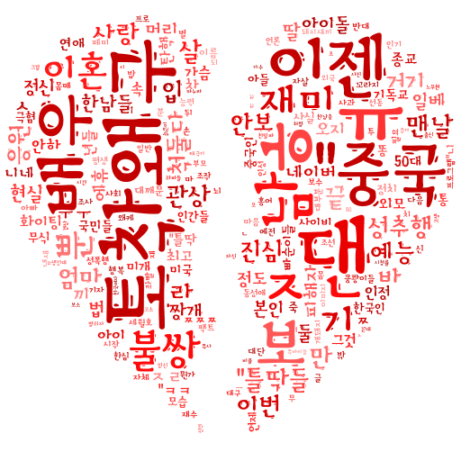
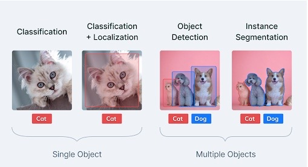

# Project_competition_study

프로그래머스 데브코스 인공지능 5기에서 수강생들이 진행한 스터디 중 하나
총 3번의 kaggle 대회를 진행

---

<h3>
 1st Competition : Covid-19 흉부 x-ray classification 과제 

  

  
  
<h3>
 Kaggle바로가기 : <a href="https://www.kaggle.com/competitions/kdtai-1/">링크</a>
</h3>

 
---

<h3>
 2nd Competition : 한국어 혐오 및 차별 텍스트 분류 과제 
</h3>

<h3>
 Kaggle바로가기 : <a href="https://www.kaggle.com/competitions/kdtai-2/">링크</a>
</h3>

---
<h3>
 3rd Competition : 동물 객체 탐지 기법 
</h3>

<h3>
 Kaggle바로가기 : <a href="https://www.kaggle.com/competitions/kdtai-2/">링크</a>
</h3>
---

